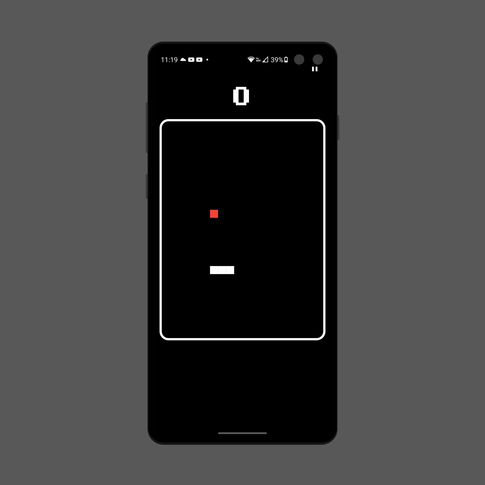
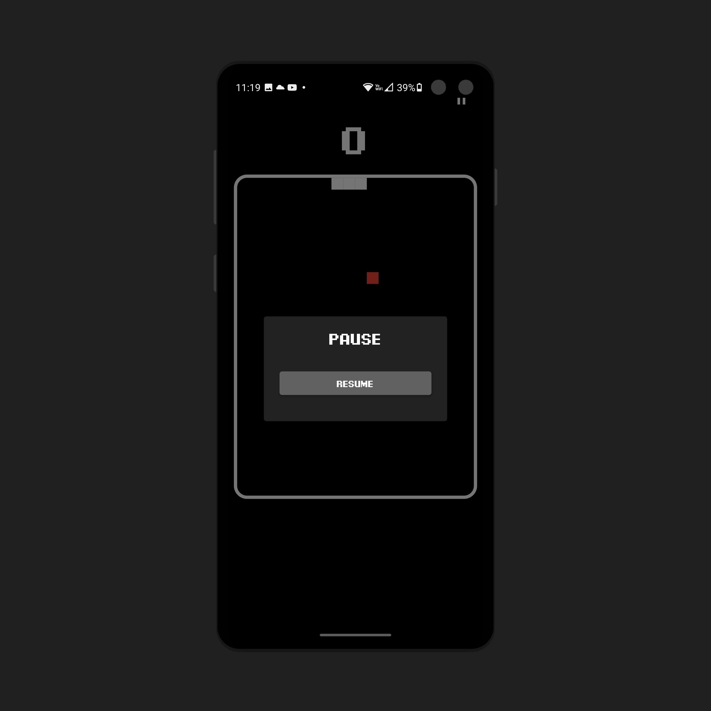

<br />
<p align="center">

  <h1 align="center">Flutter Snake</h1>

  <h2 align="center">
    A simple snake game made with Flutter
 
  </h2>
  <br>
  <p align="center">
    
    
    
</p>

  <br>
</p>

## About The Project

Just a snake game developed with Flutter

### Built With

- Dart
- [Flutter](https://flutter.dev/?gclid=CjwKCAiA1eKBBhBZEiwAX3gql7M0OFZG1Jut3GdjFAz_y2UPF_8S6W_XVwaTFqmpw5WqToqsGSkNURoCyrgQAvD_BwE&gclsrc=aw.ds)
- [Flutter Bloc](https://pub.dev/packages/flutter_bloc)

<!-- GETTING STARTED -->

## Getting Started

Before cloning the repo make sure you have installed

- [**Flutter**](https://flutter.dev/?gclid=CjwKCAiA1eKBBhBZEiwAX3gql7M0OFZG1Jut3GdjFAz_y2UPF_8S6W_XVwaTFqmpw5WqToqsGSkNURoCyrgQAvD_BwE&gclsrc=aw.ds)

### Run command

To run the app use the command:

```
flutter run
```

### Contribution

1. Fork it!
2. Create a branch for the feature you want to make: `git checkout -b my-new-feature`
3. Commit changes: `git commit -am 'Add some feature'`
4. Push to the branch: `git push origin my-new-feature`
5. Submit a pull request

<!-- CONTACT -->

## Contact

Fernando Maldonado - [@Fmaldonado4202](https://twitter.com/Fmaldonado4202) - fmaldonado824@gmail.com
